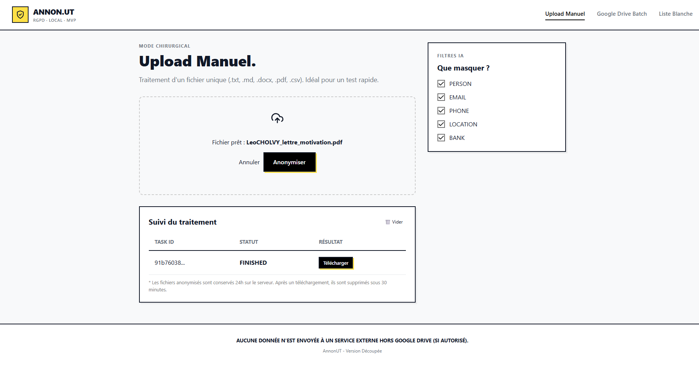
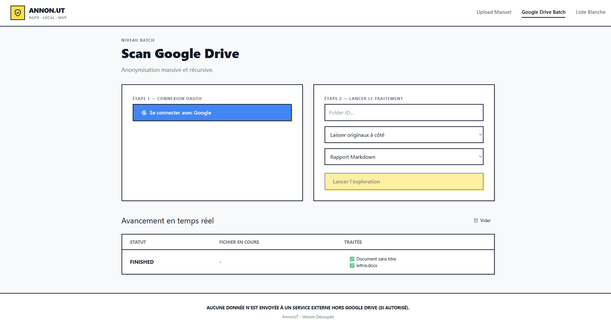
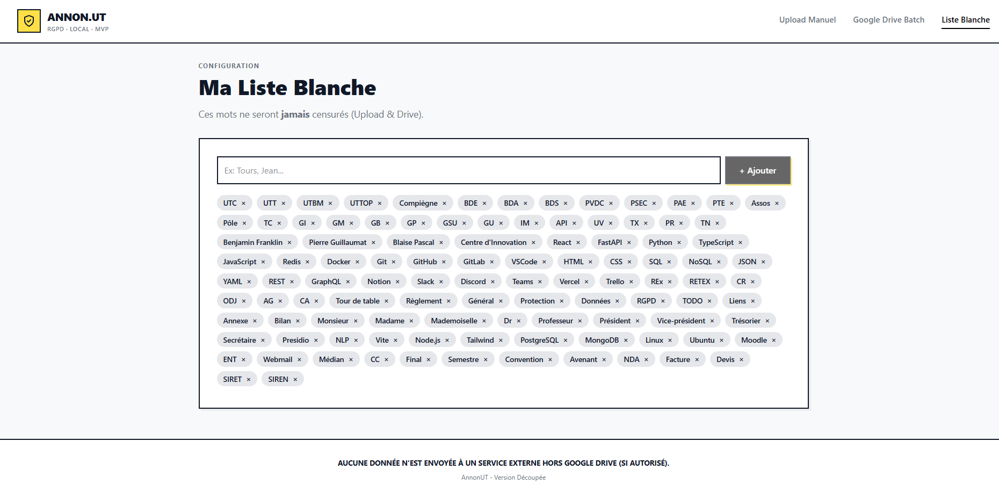

# 🛡️ Annon.UT - Outil d'Anonymisation Automatique

**Annon.UT** est une application web open-source conçue pour anonymiser automatiquement les documents sensibles (PDF, DOCX, TXT, CSV). Pensé initialement pour les associations étudiantes et l'administration (notamment de l'UTC), cet outil garantit la protection des données personnelles (RGPD) grâce à un traitement NLP local puissant.

---

## ✨ Fonctionnalités Principales

* **Mode Chirurgical (Upload Manuel) :** Glissez-déposez un fichier unique pour une anonymisation rapide et ciblée.
* **Mode Batch (Scan Google Drive) :** Connectez votre compte Google via OAuth2, fournissez l'ID d'un dossier Drive, et laissez l'outil explorer et anonymiser récursivement tous les documents (avec options de déplacement des originaux et génération de rapports).
* **Moteur IA Performant :** Utilise **Microsoft Presidio** couplé à **Spacy** (modèles Transformers/CamemBERT) pour détecter et masquer intelligemment les noms, emails, téléphones, lieux et données bancaires.
* **Liste Blanche Intelligente (Whitelist) :** Une liste configurable (et pré-remplie avec le jargon de l'UTC, des associations et de la tech) pour éviter les faux positifs. Les mots de la liste blanche ne sont jamais censurés.
* **Suivi en Temps Réel :** Suivez l'avancement de vos tâches (upload ou batch) en direct grâce aux **Server-Sent Events (SSE)**, sans rechargement de page.
* **Privacy by Design :** * Le traitement NLP (IA) est effectué **100% localement** sur le serveur.
    * Aucune donnée n'est envoyée à des services externes (hors Google Drive si utilisé).
    * Les fichiers générés s'autodétruisent après 24h, ou **30 minutes après leur téléchargement**.

---

## 📸 Captures d'écran

### Mode Chirurgical (Upload Manuel)


### Mode Batch (Scan Google Drive)


### Configuration de la Liste Blanche


---

## 🛠️ Stack Technique

L'architecture est découpée entre un frontend réactif et un backend asynchrone robuste, conteneurisé sous Docker. Il utilise un système de double *workers* (un rapide pour les petits fichiers, un standard pour les batchs lourds).

**Frontend (`annonut-front`) :**
* [React](https://reactjs.org/) & [TypeScript](https://www.typescriptlang.org/)
* [TailwindCSS](https://tailwindcss.com/) (Stylisation)
* [Vite](https://vitejs.dev/) (Bundler ultra-rapide)

**Backend (`annonut`) :**
* [FastAPI](https://fastapi.tiangolo.com/) (API Python haute performance)
* [Redis](https://redis.io/) & [RQ (Redis Queue)](https://python-rq.org/) (Gestion des tâches asynchrones)
* [Docker](https://www.docker.com/) & Docker Compose (Environnement isolé et multi-conteneurs)
* [Microsoft Presidio](https://microsoft.github.io/presidio/) & [Spacy](https://spacy.io/) (Moteur de NLP / NER)
* [PyMuPDF (fitz)](https://pymupdf.readthedocs.io/) & [python-docx](https://python-docx.readthedocs.io/) (Manipulation des fichiers)

---

## 🚀 Installation & Lancement

### Prérequis
* [Docker](https://docs.docker.com/get-docker/) et Docker Compose installés sur votre machine.
* [Node.js](https://nodejs.org/) 16+ pour le frontend.
* Un fichier `client_secret.json` généré depuis la [Google Cloud Console](https://console.cloud.google.com/) (pour l'API Google Drive).
* Un fichier `config.yaml` à la racine du backend.

### Étape 0 : Cloner le projet
```bash
git clone [https://github.com/LeoCholvy/DocAnonymiser.git](https://github.com/LeoCholvy/DocAnonymiser.git)
cd DocAnonymiser

```

### Étape 1 : Lancer le Backend (Docker)

Grâce à Docker Compose, l'API FastAPI, la base de données Redis et les Workers (files d'attentes) se lancent automatiquement avec toutes les dépendances lourdes (comme Spacy) pré-installées et mises en cache.

```bash
cd annonut

# Construire les images Docker (peut prendre quelques minutes la première fois)
docker compose build

# Lancer les conteneurs en arrière-plan
docker compose up -d

```

*Le backend sera accessible sur `http://localhost:8000`.*

### Étape 2 : Lancer le Frontend (React / Vite)

Ouvrez un nouveau terminal et exécutez :

```bash
cd annonut-front

# Installer les dépendances Node
npm install

# Lancer le serveur de développement
npm run dev

```

*L'interface sera accessible sur `http://localhost:5173`.*

---

## 🔒 Sécurité et Contributions

Ce projet a été conçu pour un usage interne et éducatif. Si vous souhaitez l'utiliser en production, assurez-vous de :

* Configurer correctement vos variables d'environnement (ne commitez jamais `client_secret.json` ou la `secret_key` des sessions FastAPI).
* Sécuriser l'accès à l'instance Redis sur votre serveur de production.
* Gérer les certificats SSL/TLS (HTTPS) car Google OAuth exige un contexte sécurisé (bien qu'un bypass local soit inclus pour le développement).

Les Pull Requests sont les bienvenues ! Pour toute modification majeure, veuillez d'abord ouvrir une *issue* pour discuter de ce que vous aimeriez changer.